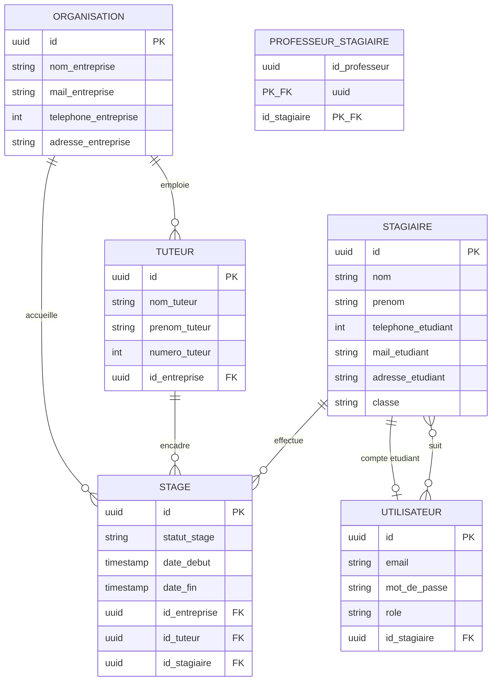

# Schéma de base de données — Gestionnaire de stages
 

```mermaid
erDiagram
    ORGANISATION ||--o{ TUTEUR : emploie
    ORGANISATION ||--o{ STAGE : accueille
    TUTEUR ||--o{ STAGE : encadre
    STAGIAIRE ||--o{ STAGE : effectue
    STAGIAIRE ||--o| UTILISATEUR : "compte etudiant"
    UTILISATEUR }o--o{ STAGIAIRE : suit
 
    ORGANISATION {
        uuid id PK
        string nom_entreprise
        string mail_entreprise
        int telephone_entreprise
        string adresse_entreprise
    }
 
    STAGIAIRE {
        uuid id PK
        string nom
        string prenom
        int telephone_etudiant
        string mail_etudiant
        string adresse_etudiant
        string classe
    }
 
    TUTEUR {
        uuid id PK
        string nom_tuteur
        string prenom_tuteur
        int numero_tuteur
        uuid id_entreprise FK
    }
 
    STAGE {
        uuid id PK
        string statut_stage
        timestamp date_debut
        timestamp date_fin
        uuid id_entreprise FK
        uuid id_tuteur FK
        uuid id_stagiaire FK
    }
 
    UTILISATEUR {
        uuid id PK
        string email
        string mot_de_passe
        string role
        uuid id_stagiaire FK
    }
 
    PROFESSEUR_STAGIAIRE {
        uuid id_professeur PK_FK
        uuid id_stagiaire PK_FK
    }
```